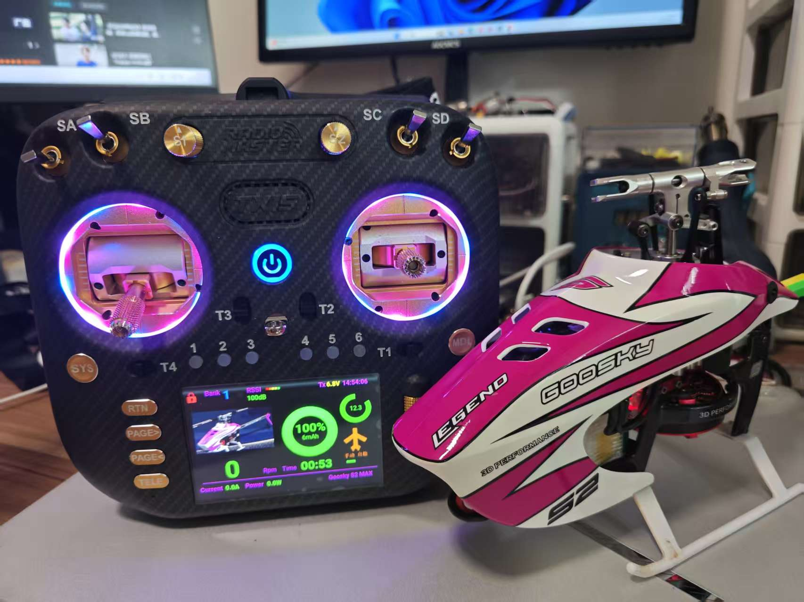

  

# RadioMaster Remote Controller Telemetry Return Interface

A comprehensive telemetry display component specially designed for the Rotolift helicopter, and it works even better when used in conjunction with the RadioMaster transmitter. The tests that have been completed include Tx15, Tx15Max, Tx16s Mk2, and Tx16Mk2.

  
  
  

## Overview

This Lua script provides real-time telemetry monitoring for your Rotorflight , displaying critical flight parameters in an easy-to-read format optimized for the screen. Simply copy to your SD card and activate in App Mode.

## Features

- **Helicopter-Specific Layout**: Tailored display for RadioMaster Nexus-X/XR parameters
- **Real-Time Telemetry**: Live updates of voltage, RPM, temperature, and signal
- **App Mode Optimization**: Full-screen display without transmitter UI clutter
- **Low Battery Alerts**: Visual and audio warnings (configurable thresholds)
- **RSS Signal Monitoring**: Signal strength bar with loss counter
- **Flight Timer Integration**: Automatic timer start/stop based on throttle
- **Flight log recording function**: displaying rotational speed, battery consumption, and performance rate curve function, for better analysis of battery performance parameters.
- **Vibration analysis**: provides real-time feedback on vibration information, assisting you in diagnosing the vibration sources of the machine.
- **flight parameters**:The setting of flight parameters does not require entering the RF adjustment script interface. It can be directly set within this script interface.

And many more...

## Requirements

- RadioMaster transmitter (or compatible Tx15 Tx16 series)
- EdgeTX 2.8+ firmware installed
- Rotorflight  with compatible telemetry receiver (elrs)
- Telemetry link established (RF module and receiver bound)
- MicroSD card (formatted FAT32)

## Production

<table>
  <tr>
    <td width="320"></td>
    <td valign="top">
      <strong>GooSky S2MAX Telemetering Script</strong>  
      Specially optimized telemetry display script for GooSky S2MAX helicopter, providing real-time flight parameter monitoring, battery voltage alerts, and vibration analysis tailored for the S2MAX model.
    </td>
  </tr>
<tr>
    <td width="320"></td>
    <td valign="top">
      <strong>GooSky S2MAX Telemetering Script</strong>  
      Specially optimized telemetry display script for GooSky S2MAX helicopter, providing real-time flight parameter monitoring, battery voltage alerts, and vibration analysis tailored for the S2MAX model.
    </td>
  </tr>
  <tr>
    <td width="320"></td>
    <td valign="top">
      <strong>Tx15Pro Telemetry Interface</strong>  
      A feature-rich telemetry display meticulously crafted for the RadioMaster Tx15Pro transmitter. Paired with the RadioMaster Nexus-X/XR gyroscope, it delivers a comprehensive and intuitive interface with extensive flight data visualization, empowering pilots with real-time insights for precision control.
    </td>
  </tr>
</table>
